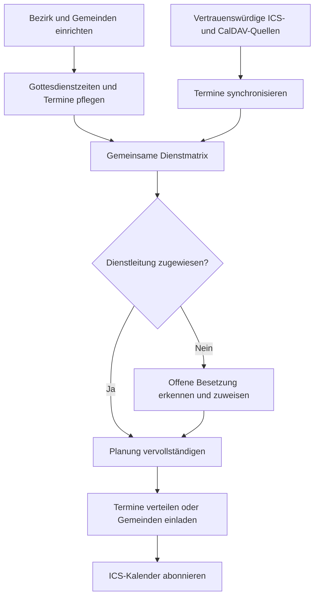
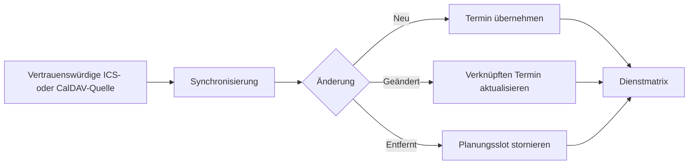
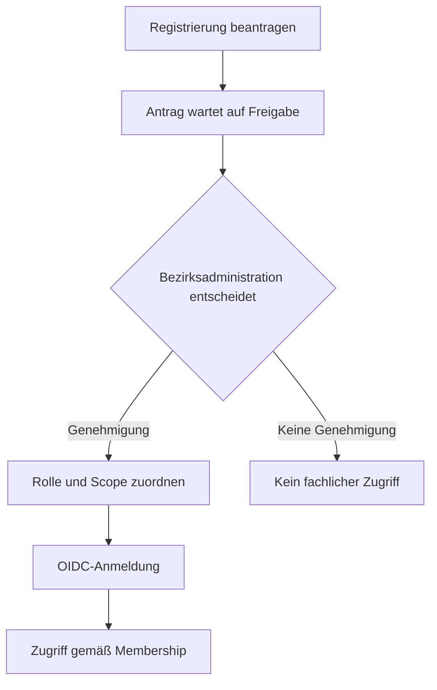

# So funktioniert der Bezirksplaner

Der NAK District Planner bündelt **Dienstplanung, Termine und Kalenderverteilung** für Gemeinden und Bezirk. Die gemeinsame Matrix ist der Ausgangspunkt für die Koordination.

## Überblick

Eine Kalenderintegration ist optional: Termine und Dienste können auch innerhalb der Anwendung verwaltet werden.

## Dienstplanung

**Beispiel:** An einem Sonntag finden Gottesdienste in mehreren Gemeinden statt. Die Matrix zeigt Termine und Gemeinden gemeinsam an. Fehlende Dienstzuweisungen sind sichtbar, ohne getrennte Kalender vergleichen zu müssen.

1. Eine berechtigte Person öffnet die **Dienstmatrix** ihres Bezirks.
2. Sie prüft unbesetzte Gottesdienste und ordnet Dienstleiter zu.
3. Berechtigte Personen sehen die aktualisierte Planung.

Die Regeln der Matrix einschließlich Feiertagsspalten stehen in [UC-03](/use-cases#uc-03-dienstplanung-lucken-visualisierung). Berechtigungen und Scope werden im [Rollenkonzept](/roles) erklärt.

## Kalender synchronisieren

In Version 1 können konfigurierte, vertrauenswürdige **ICS- und CalDAV-Kalender über HTTPS** angebunden werden.

**Abgrenzung:** V1 übernimmt Ereignisse aus explizit vertrauenswürdigen Quellen direkt. Der allgemeine Review-Prozess für unbekannte externe Ereignisse ist ein weiterführendes Vorhaben. Google Calendar und Microsoft 365 sind noch **keine produktiven V1-Connectoren**. Siehe [UC-01 und UC-02](/use-cases) und [Konfliktregeln](/conflict-rules).

## Gemeinden und Veranstaltungen verbinden

Bezirksveranstaltungen können in ausgewählten Gemeinden sichtbar werden. Bei Einladungen zwischen Gemeinden bleibt der Gastgeber erkennbar; Überschreibungen folgen festgelegten Regeln.

Fachliche Details: [UC-04: Bezirks-Events](/use-cases#uc-04-bezirks-events-verteilen) und [Einladungen zwischen Gemeinden](/invitations).

## Termine veröffentlichen

Abonnierbare ICS-Feeds stellen freigegebene Termine für andere Kalender bereit. Öffentliche Exporte enthalten nur veröffentlichte öffentliche Daten; interne Exporte können zusätzliche Informationen enthalten. Verbindlich ist [UC-05: Export](/use-cases#uc-05-sicherer-export-ical).

## Zugang und Freigabe

Ein erfolgreicher OIDC-Login allein berechtigt noch nicht zu fachlichen Änderungen. Registrierungen werden freigegeben und mit einer Rolle und einem Bezirk- oder Gemeinde-Scope verknüpft.

Technische Details: [Freigabe-Workflow](/approval-workflow), [Rollenkonzept](/roles).

## Geltungsbereich

Dieser Überblick zeigt den fachlichen Weg, nicht die Zusage eines vollständig abgeschlossenen Releases. [Architekturstatus](/architecture-status) und [OpenSpec](/documentation-map) trennen Implementierung, Zielbild und geplante Funktionen.
